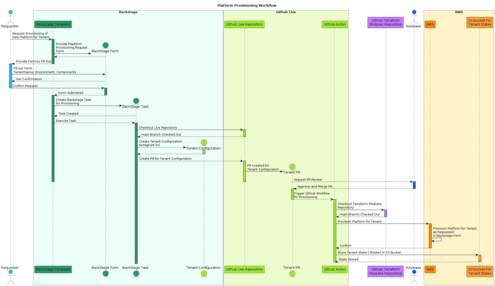

# hello-terragrunt-hub

The hub repository for the **Helloworld Terragrunt** project — a reference implementation of a self-service infrastructure platform built with [Terragrunt](https://terragrunt.gruntwork.io/).

This repo ties the project together as a set of git submodules, and is the starting point for anyone exploring, running, or contributing to the project. It provides:

- A high-level overview of how the pieces fit together
- Pointers to each component repository (as git submodules)
- Shared/top-level documentation for the project

## Architecture

```
                    ┌───────────────────────────────┐
                    │  hello-terragrunt-backstage    │
                    │  Platform Provisioning UI      │
                    └───────────────┬─────────────────┘
                                    │ provisions via
                                    ▼
                    ┌───────────────────────────────┐
                    │      hello-terragrunt-live     │
                    │  Living Tenant Configuration   │
                    └───────────────┬─────────────────┘
                                    │ instantiates
                                    ▼
                    ┌───────────────────────────────┐
                    │    hello-terragrunt-modules    │
                    │   Terraform Module Definitions │
                    └───────────────────────────────┘
```

- **[hello-terragrunt-modules](https://github.com/hoangviet1vu/hello-terragrunt-modules)** defines the reusable Terraform modules — the building blocks for infrastructure.
- **[hello-terragrunt-live](https://github.com/hoangviet1vu/hello-terragrunt-live)** holds the live Terragrunt configuration per tenant/environment, wiring modules together with real inputs.
- **[hello-terragrunt-backstage](https://github.com/hoangviet1vu/hello-terragrunt-backstage)** is the self-service portal for platform provisioning, sitting on top of the live configuration.

## Showcase: The Platform Provisioning Flow

Want to see the whole self-service experience end to end — from an end user requesting a tenant platform in Backstage, through a reviewed pull request, to Terraform state landing in an isolated S3 folder? [`docs/README.md`](docs/README.md) walks through the flow screenshot by screenshot and closes with the sequence diagram that ties every step together.



**→ [Read: The Platform Provisioning Flow](docs/README.md)**

## Repository structure

| Path | Submodule | Description |
|---|---|---|
| [`backstage/`](https://github.com/hoangviet1vu/hello-terragrunt-backstage) | `hello-terragrunt-backstage` | The Backstage instance for platform provisioning |
| [`modules/`](https://github.com/hoangviet1vu/hello-terragrunt-modules) | `hello-terragrunt-modules` | Terraform module definitions |
| [`live/`](https://github.com/hoangviet1vu/hello-terragrunt-live) | `hello-terragrunt-live` | Living tenant configuration managed by Terragrunt |

## Getting started

### Clone with submodules

```bash
git clone --recurse-submodules https://github.com/hoangviet1vu/hello-terragrunt-hub.git
```

If you already cloned without `--recurse-submodules`, fetch them with:

```bash
git submodule update --init --recursive
```

### Keeping submodules up to date

Pull the latest hub changes and sync submodules to the commits it references:

```bash
git pull
git submodule update --init --recursive
```

To pull the latest changes from each submodule's own default branch:

```bash
git submodule update --remote --merge
```

### Working inside a submodule

Each submodule is an independent repository — `cd` into it, make changes, and commit/push there as usual. Then come back to the hub, `git add <submodule-path>`, and commit to bump the pinned reference.

```bash
cd live
git checkout -b my-change
# ... make changes ...
git commit -am "..."
git push
cd ..
git add live
git commit -m "Bump live submodule"
```

## Environment variables

Running the [provisioning flow](docs/README.md) end to end touches three separate systems, each with its own required variables/secrets. Every variable is documented in detail in the owning submodule's own README — this table is just a single place to see everything needed at once.

### Backstage (local dev — `backstage/`)

Set these before `yarn start`, e.g. in a local `.env` (already gitignored):

| Variable | Purpose |
|---|---|
| `GITHUB_TOKEN` | PAT used by Backstage's GitHub integration to read/write `hello-terragrunt-live` (open the tenant-configuration PR) |
| `GITHUB_CLIENT_ID` | GitHub OAuth App ID, used for "Sign in with GitHub" |
| `GITHUB_CLIENT_SECRET` | GitHub OAuth App secret, used for "Sign in with GitHub" |

See [backstage/README.md](https://github.com/hoangviet1vu/hello-terragrunt-backstage#environment-variables) for the full list, including the Postgres variables needed only for a production deployment.

### Terragrunt CLI (local runs — `live/`)

Set these before running `terragrunt plan`/`apply` directly from a tenant folder:

| Variable | Purpose |
|---|---|
| `TG_STATE_BUCKET` | S3 bucket used for remote Terraform state |
| `AWS_REGION` | AWS region for the state backend and AWS provider |
| AWS credentials (e.g. via `aws configure`, or `AWS_ACCESS_KEY_ID` / `AWS_SECRET_ACCESS_KEY`) | Credentials Terraform/Terragrunt uses to talk to AWS |

See [live/README.md](https://github.com/hoangviet1vu/hello-terragrunt-live#before-you-run) for details, including auth options for the private `modules` repo.

### GitHub Actions (automated provisioning — `live/`, `dev` environment)

The `provision-on-merge` workflow reads these from the `dev` GitHub Environment on `hello-terragrunt-live` (Settings → Environments):

| Name | Kind | Purpose |
|---|---|---|
| `TG_STATE_BUCKET` | Variable | Same S3 bucket as above, used by the workflow's `terragrunt apply` |
| `AWS_REGION` | Variable | Same AWS region as above |
| `AWS_ACCESS_KEY_ID` | Secret | AWS credentials the workflow uses to provision infrastructure |
| `AWS_SECRET_ACCESS_KEY` | Secret | AWS credentials the workflow uses to provision infrastructure |
| `TOKEN` | Secret | PAT for HTTPS access to the private `modules` repo (only if a tenant's `terraform.source` uses `git::https://...`) |
| `SECURITY_KEY` | Secret | SSH deploy key for the `modules` repo (only if a tenant's `terraform.source` uses `git::git@github.com:...`) |

Never commit real values for any of the above — use a local `.env` / your shell environment for the first two sections, and GitHub's encrypted Environment secrets for the third.

## Documentation

Project-wide documentation and decisions that span multiple components live in this repo. Component-specific docs live in each submodule's own README.

## License

Licensed under the [Apache License 2.0](LICENSE).
