# The Platform Provisioning Flow

## Introduction

**Hello Terragrunt** is a Proof of Concept (POC) for self-service **Platform Provisioning**: a way for any team to request an isolated, ready-to-use AWS environment for their tenant without opening a ticket, waiting on a platform engineer, or hand-writing Terraform.

The POC wires together three pieces of the [hub](../README.md):

- **[Backstage](https://github.com/hoangviet1vu/hello-terragrunt-backstage)** — the self-service front door where an end user describes what they need.
- **[Live](https://github.com/hoangviet1vu/hello-terragrunt-live)** — the GitOps repository holding one `terragrunt.hcl` per tenant/environment, plus the GitHub Actions workflow that provisions it.
- **[Modules](https://github.com/hoangviet1vu/hello-terragrunt-modules)** — the versioned Terraform modules that define exactly what gets created on AWS.

What follows walks through a single request end to end — from an end user logging into Backstage, to a reviewed pull request, to Terraform state landing in a tenant-scoped S3 folder — and closes with the full sequence diagram tying every step together.

## Walkthrough

### 1. The end user signs in to Backstage

An end user who wants a platform for their business starts at the Backstage UI and signs in with their GitHub identity.

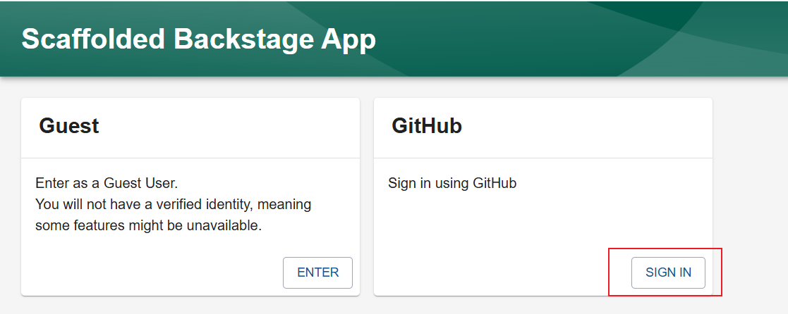

### 2. They pick the Tenant Provisioning template

From the Backstage software catalog, the user chooses the **Tenant Provisioning** template — the scaffolder template that collects everything needed to generate a tenant's Terragrunt configuration.

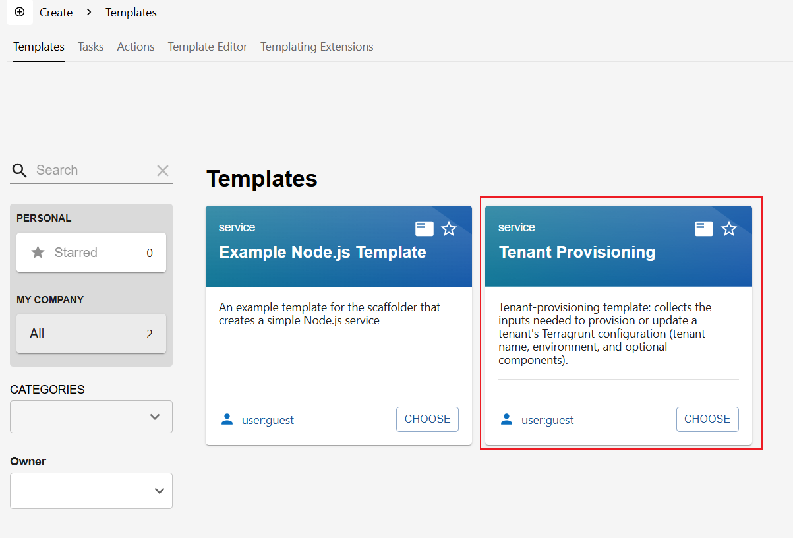

### 3. They describe the platform they want

The template form asks for exactly three things: the **tenant name**, the target **environment** (`dev`, `test`, `uat`, or `prod`), and the **AWS components** to enable. An S3-backed foundation is provisioned by default for every tenant; `ecr` and `dynamodb` are opt-in.

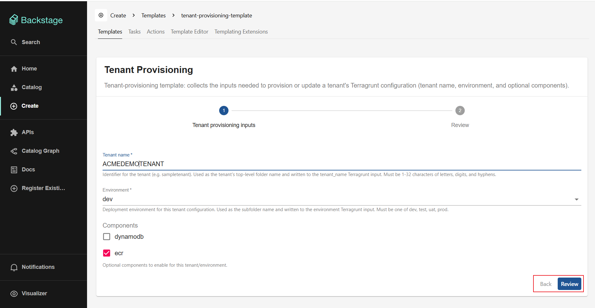

### 4. They review and confirm the request

Before anything is created, Backstage shows a confirmation summary of the tenant name, environment, and selected components, so the request can be double-checked before it's submitted.

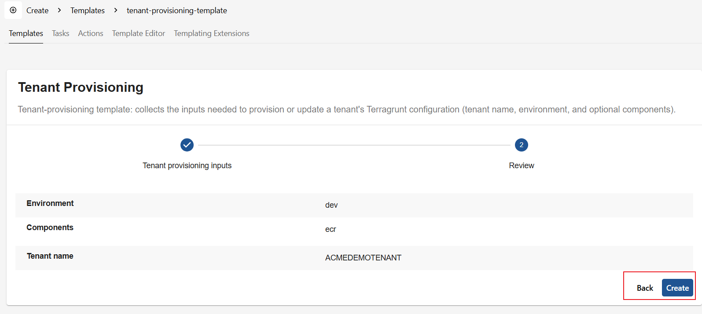

### 5. Backstage generates the configuration and opens a PR

Submitting the form kicks off a Backstage scaffolder task. The task checks out the `live` repository, writes a new `terragrunt.hcl` under `<tenant_name>/<environment>/`, and opens a pull request against `hello-terragrunt-live` — all without the requester touching Terraform or Git directly.

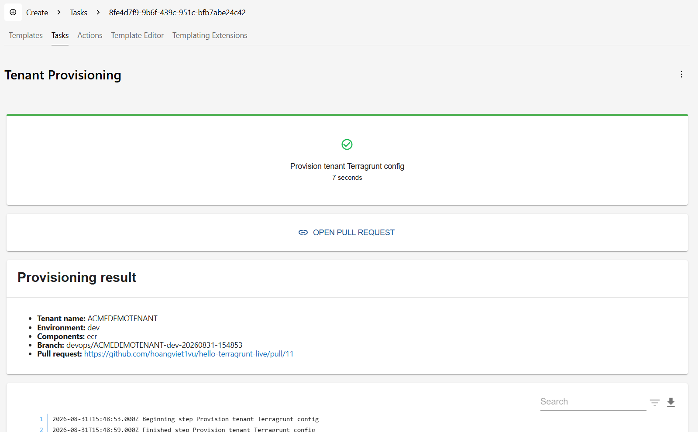

The generated file is intentionally small — it only wires together *what* module to use and *which* inputs apply to this tenant:

```hcl
include "root" {
  path = find_in_parent_folders("root.hcl")
}

terraform {
  source = "git::git@github.com:hoangviet1vu/hello-terragrunt-modules.git//?ref=main"
}

inputs = {
  tenant_name     = "ACMEDEMOTENANT"
  environment     = "dev"
  enable_dynamodb = false
  enable_ecr      = true
}
```

### 6. The request lands as a pull request on GitHub

The PR is opened on `hello-terragrunt-live`, holding exactly one new file — the tenant's `terragrunt.hcl` — and is left **awaiting approval** for a human reviewer.

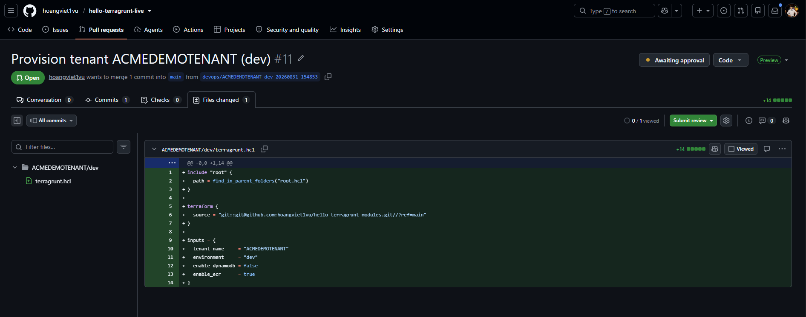

### 7. A reviewer approves, and provisioning kicks off

Once a reviewer approves and merges the PR, a GitHub Actions workflow is triggered automatically. It resolves the module `source` pinned in the tenant's `terragrunt.hcl`, checks out the matching commit of `hello-terragrunt-modules`, and runs `terragrunt apply` to provision the platform on AWS.

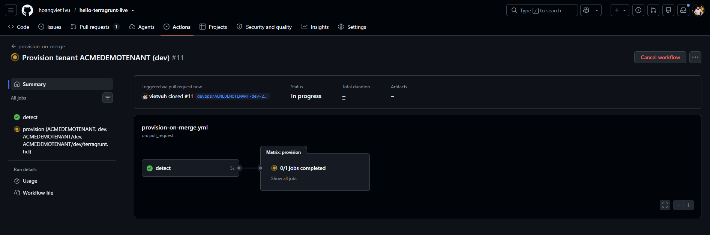

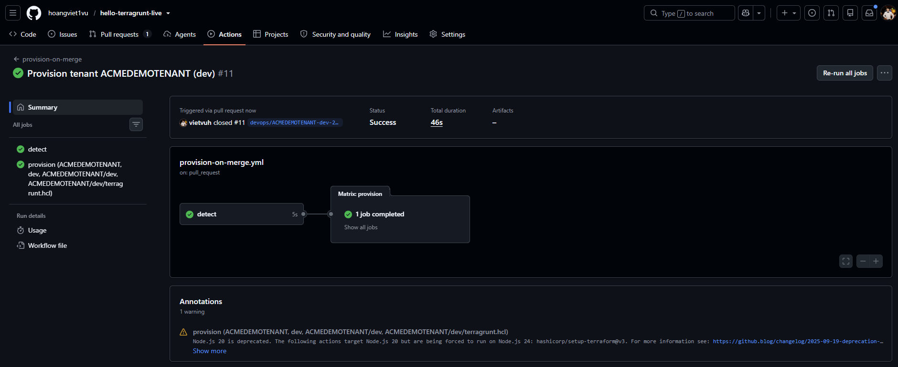

### 8. The platform exists on AWS — scoped to what was requested

Only the components the requester selected get created. In this example `ecr` was checked and `dynamodb` was not, so the tenant ends up with its own ECR repository and nothing else beyond the default S3-backed foundation.

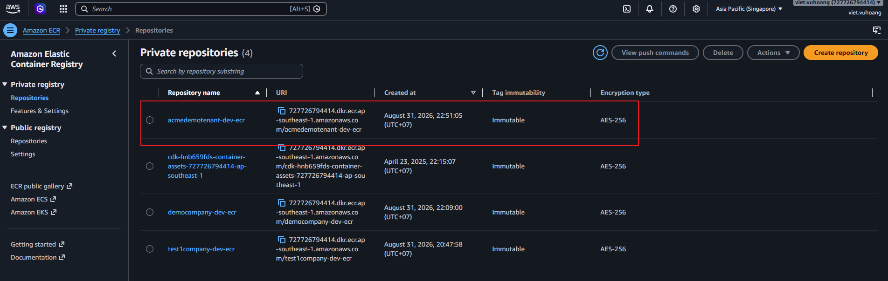

### 9. Terraform state is stored, isolated per tenant and environment

The workflow's final step pushes the resulting `terraform.tfstate` into a dedicated `<tenant_name>/<environment>/` folder in the shared Terraform state S3 bucket — so every tenant/environment pair owns its own state, with no risk of one tenant's `apply` touching another's resources.

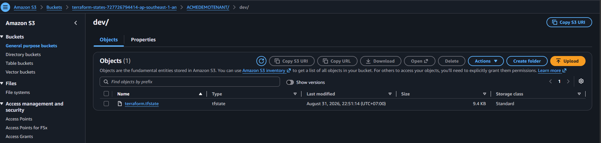
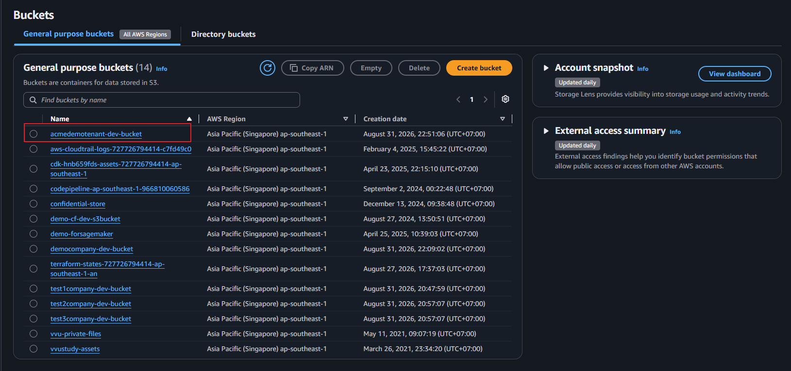

## The full workflow

The sequence above is formally captured in [`worlkflow.puml`](worlkflow.puml) (PlantUML). It traces the same request from the initial Backstage interaction through to state being stored in S3, across four actors: the **Requester**, **Backstage**, the **Reviewer**, and the **Github Live** repository / **AWS** systems that do the provisioning.


At a glance, the diagram shows three phases:

1. **Request** — the requester fills out and confirms the Backstage form; Backstage creates a task that checks out `live`, generates the tenant's `terragrunt.hcl`, and opens a PR.
2. **Review** — a reviewer approves and merges the PR, which triggers the GitHub Actions provisioning workflow.
3. **Provision** — the workflow checks out `modules`, applies the Terraform-defined infrastructure to AWS, and stores the resulting state in the tenant's S3 folder.

## Why this matters

> By this way, the Tenant Platform will be easily provisioned, and the Infrastructure/Platform Components will be managed as code (`terragrunt.hcl`) and having isolated state (S3 folder).

A few consequences fall out of that design:

- **Self-service without losing control.** The requester never touches Terraform, AWS credentials, or the Terraform state backend — they fill out a form. The reviewer stays the single gate between "requested" and "provisioned," so every platform change is human-approved before it runs.
- **Infrastructure as code, by construction.** Because the only artifact a request produces is a `terragrunt.hcl` file in git, *every* tenant platform — what it is, when it changed, and who approved it — is fully described by the commit history of the `live` repository. There's no drift between "what's documented" and "what's deployed," because they're the same file.
- **A single source of truth for what can be provisioned.** All tenants consume the same versioned modules from `hello-terragrunt-modules`. Improving or hardening a module (a security fix, a new default, a compliance guardrail) benefits every tenant the next time their configuration is applied — instead of every tenant reinventing (and maintaining) its own copy.
- **True multi-tenant isolation.** Each `<tenant_name>/<environment>` pair gets its own Terragrunt working directory *and* its own Terraform state file, isolated by S3 key. One tenant's `apply` can't corrupt another's state, and blast radius for any single change is naturally scoped to one tenant/environment.
- **It scales horizontally, not by headcount.** Onboarding the 100th tenant takes the same platform-engineering effort as the 2nd: fill out the form, review the PR, merge. Growth doesn't grow the platform team's workload — the bottleneck is a lightweight PR review, not a queue of manual provisioning tickets.
- **A built-in audit trail.** Pull requests and GitHub Actions runs are, by themselves, a durable record of every provisioning and change event — who requested it, who approved it, and what the automation actually did — with no extra tooling required.
